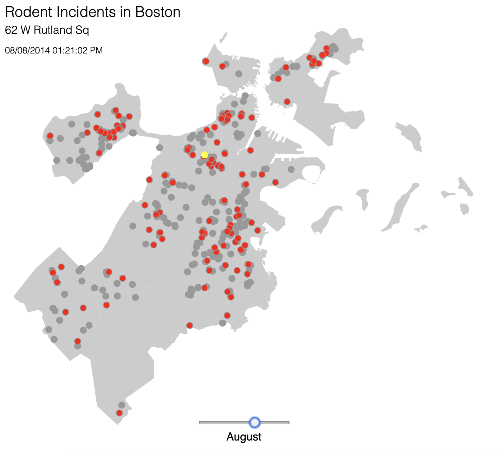
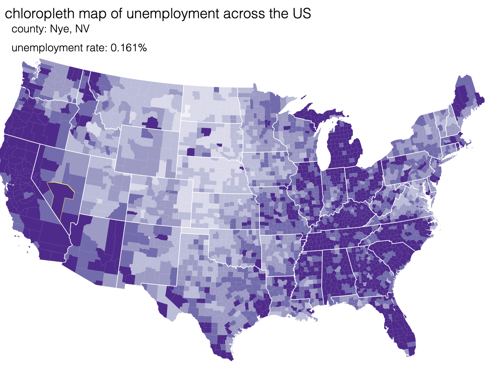

### README.md

#### d3.js tutorials I used
*https://www.tutorialsteacher.com/d3js*
*http://learnjsdata.com/read_data.html* (used this to supplement basics, first one was slightly outdated)
*http://maptimeboston.github.io/d3-maptime*
*http://duspviz.mit.edu/d3-workshop/mapping-data-with-d3/*

I chose to do tutorials on d3 because it is a versatile js data visualization library and I would love to incorporate data visualizations into my project. For this hack-a-thing, I wanted to build some simple maps with user interactions.

#### What I learned
The maptime boston tutorial was a fun way to see how this could be applied to a (sort of) real world situation. The MIT tutorial of the same rat-map thing was an expansion on the basic map, which was cool to do as it involved more than just static shapes -- added events, and a time slider.

The second tutorial from MIT was a TopoJSON tutorial, which was something I had never heard of before despite working a lot with geoJSON this summer. This tutorial teaches how to make a choropleth map. I also added my own little interactions to show the county name as well as the unemployment rate on hover (wrote a small script to create a tsv file and then just parsed it to separate out the county name and state abbreviation while processing the file).
**to access the result of this tutorial, run the project locally and go to `localhost:[port]/index2.html`**

In general, I learned how to use basic d3 functionality and how simple the methods are to get some really cool interactions. D3 has a wide range of nice features: it supports chaining of methods,  has some css-in-js, and can adapt any file format to be used as data with built-in methods. I also learned that there are lots of rats in Boston during August. 

#### demo: 

#### What didn't work
I had a bit of trouble finding the right tsv files with all the information I wanted so I found a couple and and wrote a little script to make them work together. Additionally, although the tutorials I followed were great, I had to do extra research to personally understand what each function was doing - especially the `mesh` function used in the second example.

#### Notes
The first couple of tutorials were just getting the basics down, so I've left the scripts in this repo but commented out the code in the index as it was cluttering the page -- you can see I was trying a bunch of different basic features of d3. There was also a small chart exercise in the maptime boston demo that is in the script file `charttime.js` but I've commented it out of the `index.html`.